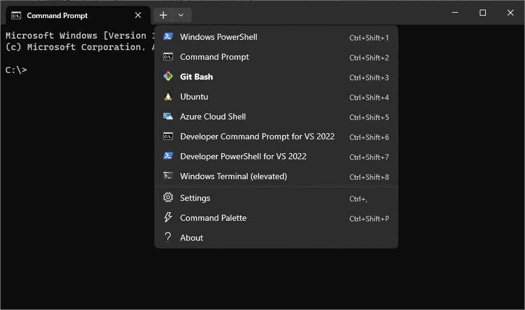

# WindowsTerminalConfig
Windows Terminal configuration file with a few extra features.

## Local installation :hammer_and_wrench:
Start by installing [Windows Terminal](https://www.microsoft.com/en-us/p/windows-terminal/9n0dx20hk701), if you haven't already done so.

To install the updated configuration from a Windows 10 Command Prompt:
```
cd %LOCALAPPDATA%\Packages\Microsoft.WindowsTerminal_8wekyb3d8bbwe\LocalState
move settings.json settings_backup.json
git init .
git remote add origin https://github.com/JacobBerlin/WindowsTerminalConfig.git
git pull origin main
git branch --set-upstream-to=origin/main main
```
To install future updates:
```
cd %LOCALAPPDATA%\Packages\Microsoft.WindowsTerminal_8wekyb3d8bbwe\LocalState
git pull
```

## Additional features :heavy_check_mark:
* [Git Bash](https://git-scm.com) shell (default if installed)
* CTRL+T to open a tab
* CTRL+W to close a tab
* Relaunch Windows Terminal in elevated state

## Example :rocket:
