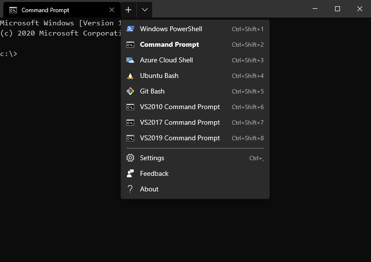

# WindowsTerminalConfig
Windows Terminal configuration file with a few extra features.

## Local installation :hammer_and_wrench:
Start by installing [Windows Terminal](https://www.microsoft.com/en-us/p/windows-terminal/9n0dx20hk701), if you haven't already done so.

To install the updated configuration from a Windows 10 Command Prompt:
```properties
cd %LOCALAPPDATA%\Packages\Microsoft.WindowsTerminal_8wekyb3d8bbwe\LocalState
move settings.json settings_backup.json
git init .
git remote add origin https://github.com/JacobBerlin/WindowsTerminalConfig.git
git pull origin master
git branch --set-upstream-to=origin/master master
```

## Additional features :heavy_check_mark:
* Open Command Prompt by default
* Copy on mouse select
* CTRL+T to open a tab
* CTRL+W to close a tab
* CTRL+SHIFT+4 to open an [Ubuntu Bash](https://www.microsoft.com/en-us/p/ubuntu/9nblggh4msv6) shell (if installed)
* CTRL+SHIFT+5 to open a [Git Bash](https://git-scm.com) shell (if installed)
* CTRL+SHIFT+6 to open a [Visual Studio 2010 Professional](https://visualstudio.microsoft.com/vs/) Developer Command Prompt (if installed)
* CTRL+SHIFT+7 to open a [Visual Studio 2017 Enterprise](https://visualstudio.microsoft.com/vs/) Developer Command Prompt (if installed)
* CTRL+SHIFT+8 to open a [Visual Studio 2019 Enterprise](https://visualstudio.microsoft.com/vs/) Developer Command Prompt (if installed)

Note: The shortcut number depends on which shells are installed!

## Example :rocket:
